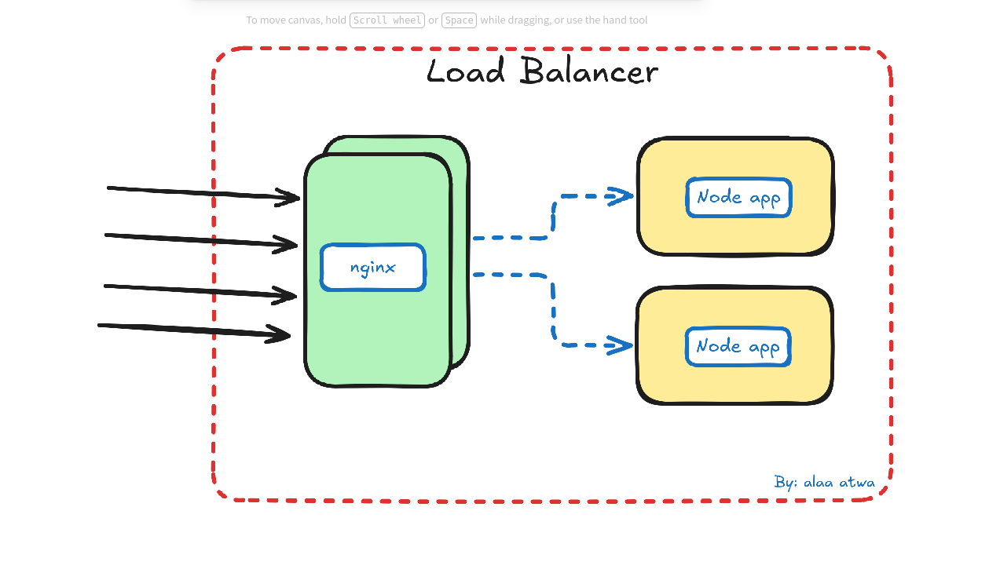

## overview 

- nginx as a load balancer with nodejs apps.


## build and scale 
```bash 

docker compose up --build --scale node-app=2 
# run two instances of the node-app service 

```

## test the load balancer 
```bash 

curl localhost:8080
# repeat the command to see different messages coming about traffic coming from node-app1 node-app2 ...

```
