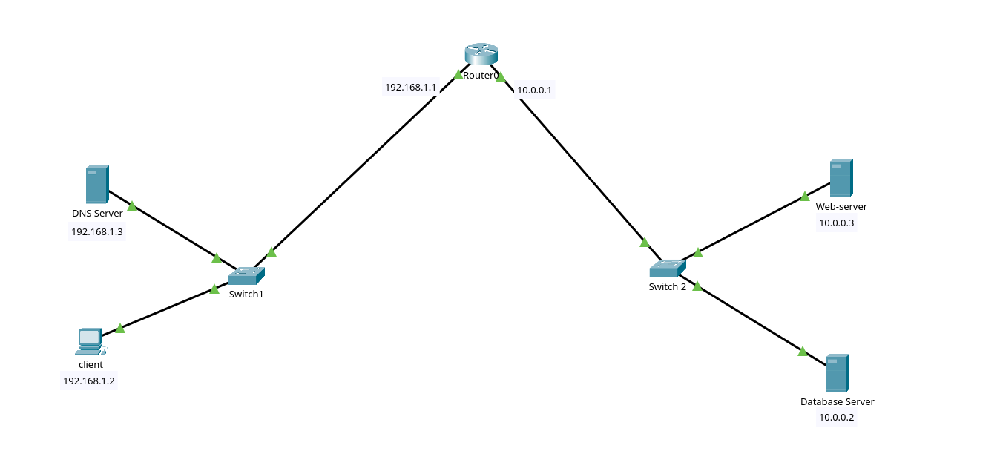

# mini-production-env Lab (Packet Tracer)

## Overview

This project is a hands-on networking lab built using Cisco Packet Tracer to simulate a simple production-like environment. The goal is to practice networking concepts that are directly relevant to DevOps, such as connectivity, DNS resolution, service access, and basic network security.

The lab includes a client machine, DNS server, web server, database server, and a router connecting two networks.



---

## Lab Topology

* Client PC
* DNS Server
* Web Server
* Database Server
* Router
* Switches

Two networks are connected through a router:

* Client Network: `192.168.1.0/24`
* Server Network: `10.0.0.0/24`

---

## What This Lab Demonstrates

* IP addressing and subnetting
* Routing between networks
* DNS configuration and name resolution
* HTTP service access
* Basic access control using ACLs
* Troubleshooting connectivity issues

---

## IP Addressing Plan

### Client Network

* Client: `192.168.1.2`
* DNS Server: `192.168.1.20`
* Gateway: `192.168.1.1`

### Server Network

* Web Server: `10.0.0.3`
* Database Server: `10.0.0.2`
* Gateway: `10.0.0.1`

---

## Configuration Steps

### 1. Build the Topology

* Add 1 router, 2 switches, and 4 end devices (PC + 3 servers)
* Connect devices using appropriate cables

---

### 2. Configure IP Addresses

Assign IPs manually to all devices based on the plan above.

On the client:

* Set IP, subnet mask, default gateway, and DNS server

---

### 3. Configure the Router

```bash
enable
configure terminal

interface g0/0
ip address 192.168.1.1 255.255.255.0
no shutdown

interface g0/1
ip address 10.0.0.1 255.255.255.0
no shutdown
```

---

### 4. Configure DNS Server

* Enable DNS service
* Add record:

  ```
  myapp.local → 10.0.0.3
  ```

---

### 5. Configure Web Server

* Enable HTTP service
* Edit the index page with a simple message:

  ```
  Welcome to DevOps Lab
  ```

---

### 6. Test Connectivity

From the client:

* Ping web server:

  ```
  ping 10.0.0.3
  ```

* Test DNS:

  ```
  ping myapp.local
  ```

* Open browser:

  ```
  http://myapp.local
  ```

---

### 7. Configure Access Control (ACL)

Block client access to the database server while allowing other traffic:

```bash
access-list 100 deny ip host 192.168.1.2 host 10.0.0.2
access-list 100 permit ip any any

interface g0/0
ip access-group 100 in
```

---

### 8. Verify ACL Behavior

From the client:

* This should fail:

  ```
  ping 10.0.0.2
  ```

* This should work:

  ```
  ping 10.0.0.3
  ```

---

### Note

- further improvements coming later for this lab.
